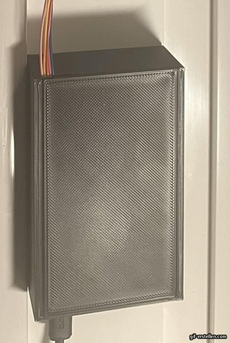
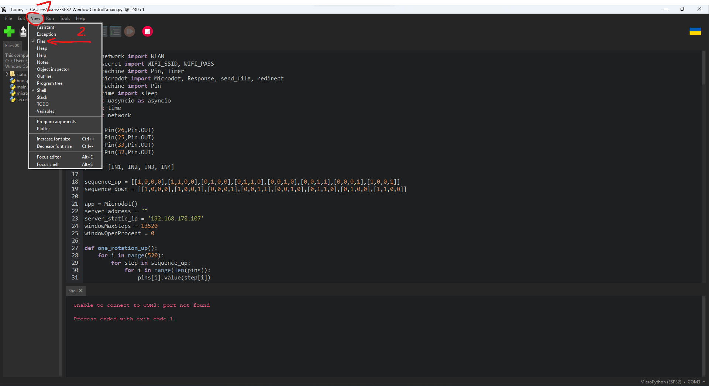
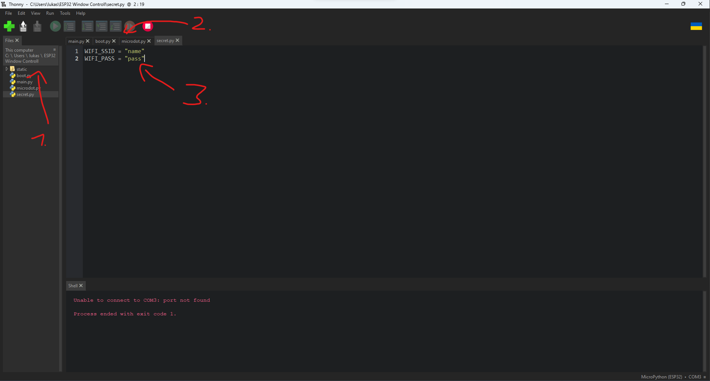
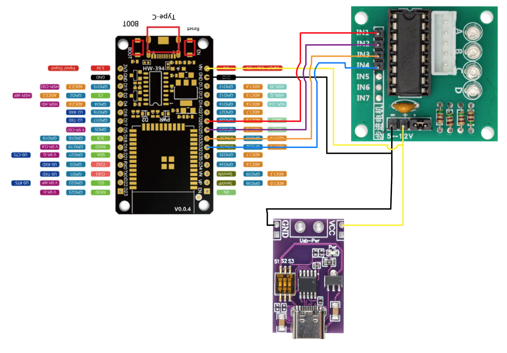

# ❗️❗️❗️Work in progress readme❗️❗️❗️

# Windows Rollo

This project is an affordable and simple way to operate window blinds with a motor, which most people have lying around.

|             28byj-48 holder              |           Case            |
| :--------------------------------------: | :-----------------------: |
|  |  |

[Download form Printables](https://www.printables.com/model/666636/edit)

## Description

This project can be used with Homebridge, but it is not mandatory. The ESP also creates a web page for easy control via the web browser. So far, I have only managed to integrate it into the Apple ecosystem using Homebridge and a plugin. I tried using Home Assistant, but since I am new to it, I don't know how to call a REST endpoint when using a slider. If anyone knows how to do this and shares it with me, I will incorporate it

## You need

| Name               | Description                                          | with out Ref Link                                                                                                                                                                                                                                                                                                                                                                                | Ref Link                                                     |
| ------------------ | ---------------------------------------------------- | ------------------------------------------------------------------------------------------------------------------------------------------------------------------------------------------------------------------------------------------------------------------------------------------------------------------------------------------------------------------------------------------------ | ------------------------------------------------------------ |
| 28BYJ-48 + ULN2003 | The stepper motor with and without ref link.         | [5v](https://www.amazon.de/-/en/Reland-28BYJ-48-ULN2003-Stepper-Driver/dp/B09QQLMYWP/ref=sr_1_11?crid=2WY592T3TWVZG&keywords=28BYJ-48&qid=1699528969&sprefix=28byj-48%2Caps%2C146&sr=8-11&th=1),[12v](https://www.amazon.de/-/en/Reland-28BYJ-48-ULN2003-Stepper-Driver/dp/B09QQK2WXP/ref=sr_1_11?crid=2WY592T3TWVZG&keywords=28BYJ-48&qid=1699528969&sprefix=28byj-48%2Caps%2C146&sr=8-11&th=1) | [5v](https://amzn.to/3Gj90uz),[12v](https://amzn.to/416ovzJ) |
| ESP32              | The micro controller i used                          | [Aliexpress](https://de.aliexpress.com/item/1005005564949759.html?spm=a2g0o.order_list.order_list_main.150.875d5c5fICiXLY&gatewayAdapt=glo2deu)                                                                                                                                                                                                                                                  | -                                                            |
| Power supply       | USB C min 9v 3a min                                  | [Aliexpress](https://de.aliexpress.com/item/1005005120681277.html?spm=a2g0o.order_list.order_list_main.53.4ba65c5f8E3WuL&gatewayAdapt=glo2deu)                                                                                                                                                                                                                                                   | -                                                            |
| USB C Power Board  | Can be used to power the project with one USB C port | [Aliexpress](https://de.aliexpress.com/item/1005004356272196.html?spm=a2g0o.order_list.order_list_main.41.4f855c5fDKtKsm&gatewayAdapt=glo2deu)                                                                                                                                                                                                                                                   | -                                                            |

- You still need some general things to do this project. This includes a [3D Printer](https://www.elegoo.com/en-de/products/elegoo-neptune-4-pro-fdm-3d-printer), M4 screws, and a few cables with a soldering station or soldering iron with solder.

## Installation

### ! Not finished !

  
ESP32 Flashing

1. Plug the ESP32 in to your computer  
   Optional: [Video guide](https://www.youtube.com/watch?v=fmgQ8Dcg9uM) | [Written guide](https://docs.micropython.org/en/latest/esp32/tutorial/intro.html)

2. Intall [Thonny](https://thonny.org/)

3. Install Microypthon **_remember the com port_** and click on Configure interpeter...
   .png>)

4. .png>)

5. Select the Port and all other values. Install
   .png>)

6. Clone the repo or download it [here](https://github.com/Sniphs98/Simple_window_blind_motor_refit/archive/refs/heads/master.zip)

7. Enable files under view
   

8. Open the folder with the project and open alle files
   

9. Open the secret.py file and **_replace_** name with the Name of you WLAN and pass for the Password of your WLAN

  
Case and cabel Installation

  

## Used Repositories:

| Name                                                       | Description                                                      |
| ---------------------------------------------------------- | ---------------------------------------------------------------- |
| [Microdot](https://github.com/miguelgrinberg/microdot.git) | enables the esp32 rest endpoint to be made available for control |

#### Optional HomeBridge:

| Name                                                                          | Description                                          |
| ----------------------------------------------------------------------------- | ---------------------------------------------------- |
| [HomeBridge](https://github.com/homebridge/homebridge)                        | Integrated the control in Apple Home                 |
| [homebridge-http-slider](https://github.com/datMaffin/homebridge-http-slider) | Provides a slider in Homebridge to use in Apple Home |

## TODO

- Readme finishing
- describe installation
- video
- better calibration and Installation process
- Home assistant integration
